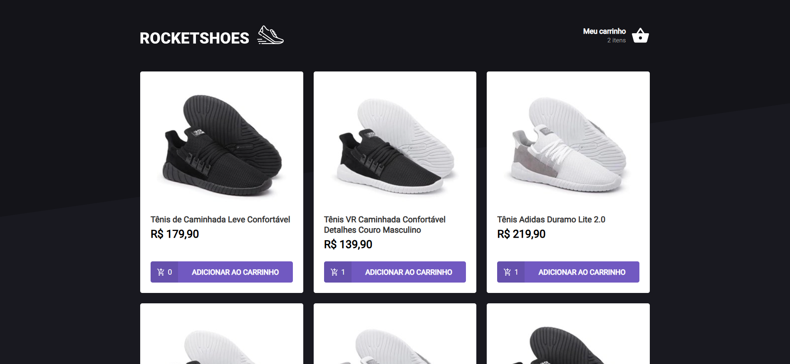

<h1 align="center">
  
</h1>

<h3 align="center">
  Desafio: Criando um hook de carrinho de compras
</h3>

<p align="center">Aplicação para listagem de produtos e carrinho de compras</p>

<p align="center">
  <a href="#como-executar-o-projeto">Como executar o projeto</a>&nbsp;&nbsp;&nbsp;|&nbsp;&nbsp;&nbsp;
  <a href="#sobre-o-desafio">Sobre o Desafio</a>
</p>

<p align="center">Front-end</p>

<p align="center">
  
</p>

## Como executar o projeto

### Clonar este repositório

```bash
git clone https://github.com/eliasmcastro/rocketseat-ignite-reactjs-desafio-hook-carrinho-de-compras.git
```

### Requisitos

- [Node.js](https://nodejs.org) na versão 16.14.0
- [Yarn](https://yarnpkg.com) na versão 1.22.5

### Passos para a execução

**1. Executar aplicação**

Instalar as dependências do projeto

```bash
yarn
```

Iniciar a Fake API

```bash
yarn server
```

A Fake API começará a ser executado em http://localhost:3333

Iniciar o servidor de desenvolvimento

```bash
yarn start
```

A aplicação começará a ser executada em http://localhost:8080

**2. Executar testes unitários**

Para executar os testes unitários

```bash
yarn test
```

## Sobre o desafio

Essa será uma aplicação onde o seu principal objetivo é criar um hook de carrinho de compras. Você terá acesso a duas páginas, um componente e um hook para implementar as funcionalidades pedidas nesse desafio:

- Adicionar um novo produto ao carrinho;
- Remover um produto do carrinho;
- Alterar a quantidade de um produto no carrinho;
- Cálculo dos preços sub-total e total do carrinho;
- Validação de estoque;
- Exibição de mensagens de erro;

### Preservando carrinho com localStorage API

Para preservar os dados do carrinho mesmo se fecharmos a aplicação, utilizaremos a localStorage API.

Para salvar os dados, você deve utilizar o método `setItem`. Como primeiro argumento você deve informar o nome que você quer dar para o registro, no caso desse desafio é obrigatório utilizar o nome `@RocketShoes:cart`. Já o segundo argumento é o valor do registro que obrigatoriamente precisa estar no formato `string`.

```js
localStorage.setItem('@RocketShoes:cart', cart)
```

Para recuperar os dados, você deve utilizar o método `getItem` passando como argumento do registro que, no caso desse desafio, é obrigatório utilizar como `@RocketShoes:cart`. Abaixo segue um exemplo:

```js
const storagedCart = localStorage.getItem('@RocketShoes:cart');
```

### Mostrando erros com toastify

Para mostrar os erros em tela, iremos utilizar um pacote chamado react-toastify. Ela ajuda a mostra informações temporárias e rápidas de uma forma bem bonita.

De todos os métodos, utilizaremos apenas o error e será obrigatório utilizar mensagens predefinidas para que os testes passem.

### O que devo editar na aplicação?

Os arquivos que devem ser editados são:

- src/components/Header/index.tsx
  - Você deve receber o array `cart` do hook `useCart` e mostrar em tela a quantidade de produtos distintos adicionados ao carrinho. Dessa forma, se o carrinho possui 4 unidades do item A e 1 unidade do item B o valor a ser mostrado é `2 itens`.
- src/pages/Home/index.tsx
  - Você deve renderizar os produtos buscados da fake API em tela com as informações de título, imagem, preço e quantidade adicionada ao carrinho. Por fim, é preciso implementar a funcionalidade de adicionar o produto escolhido ao carrinho ao clicar no botão `ADICIONAR AO CARRINHO`.
  - Nesse arquivo, temos três pontos importantes a serem implementados:
    - **cartItemsAmount**: Deve possuir as informações da quantidade de cada produto no carrinho. Sugerimos criar um objeto utilizando `reduce` onde a chave representa o id do produto e o valor a quantidade do produto no carrinho. Exemplo: se você possuir no carrinho um produto de id 1 e quantidade 4 e outro produto de id 2 e quantidade 3.
    - **loadProducts**: Deve buscar os produtos da Fake API e formatar o preço utilizando o helper `utils/format`
    - **handleAddProduct**: Deve adicionar o produto escolhido ao carrinho.
- src/pages/Cart/index.tsx
  - Você deve renderizar uma tabela com a imagem, título, preço unitário, quantidade de unidades e preço subtotal de cada produto no carrinho. Além disso, também é preciso renderizar o preço total do carrinho. Por fim, é preciso implementar as funcionalidades dos botões de decrementar, incrementar e remover o produto do carinho.
  - Nesse arquivo, temos cinco pontos importantes a serem implementados:
    - **cartFormatted:** Deve formatar o carrinho adicionando os campos `priceFormatted` (preço do produto) e `subTotal` (preço do produto multiplicado pela quantidade) ambos devidamente formatados com o `utils/format`.
    - **total:** Deve possuir a informação do valor total do carrinho devidamente formatado com o `utils/format`.
    - **handleProductIncrement:** Deve aumentar em 1 unidade a quantidade do produto escolhido ao carrinho.
    - **handleProductDecrement:** Deve diminuir em 1 unidade a quantidade do produto escolhido ao carrinho, onde o valor mínimo é 1 (nesse caso o botão deve estar desativado).
    - **handleRemoveProduct:** Deve remover o produto escolhido do carrinho.
- src/hooks/useCart.tsx
  - Apesar de não retornar diretamente nenhuma renderização de elementos na interface como os outros arquivos, esse é o coração do desafio. Ele é responsável por:
    - hook `useCart`;
    - context `CartProvider`;
    - manipular `localStorage`;
    - exibir `toasts`.
  - Então é aqui que você vai implementar as funcionalidades que serão utilizadas pelo restante do app. Os principais pontos são:
    - **cart:** Deve verificar se existe algum registro com o valor `@RocketShoes:cart` e retornar esse valor caso existir. Caso contrário, retornar um array vazio.
    - **addProduct:** Deve adicionar um produto ao carrinho. Porém, é preciso verificar algumas coisas:
      - O valor atualizado do carrinho deve ser perpetuado no **localStorage** utilizando o método `setItem`.
      - Caso o produto já exista no carrinho, não se deve adicionar um novo produto repetido, apenas incrementar em 1 unidade a quantidade;
      - Verificar se existe no estoque a quantidade desejada do produto. Caso contrário, utilizar o método `error` da **react-toastify** com a seguinte mensagem:
    
        ```jsx
        toast.error('Quantidade solicitada fora de estoque');
        ```
    
      - Capturar utilizando `trycatch` os erros que ocorrerem ao longo do método e, no catch, utilizar o método `error` da **react-toastify** com a seguinte mensagem:
    
        ```jsx
        toast.error('Erro na adição do produto');
        ```
    
    - **removeProduct:** Deve remover um produto do carrinho. Porém, é preciso verificar algumas coisas:
      - O valor atualizado do carrinho deve ser perpetuado no **localStorage** utilizando o método `setItem`.
      - Capturar utilizando `trycatch` os erros que ocorrerem ao longo do método e, no catch, utilizar o método `error` da **react-toastify** com a seguinte mensagem:
    
        ```jsx
        toast.error('Erro na remoção do produto');
        ```
    
    - **updateProductAmount:** Deve atualizar a quantidade de um produto no carrinho. Porém, é preciso verificar algumas coisas:
      - O valor atualizado do carrinho deve ser perpetuado no **localStorage** utilizando o método `setItem`.
      - Se a quantidade do produto for menor ou igual a zero, sair da função **updateProductAmount** instantaneamente.
      - Verificar se existe no estoque a quantidade desejada do produto. Caso contrário, utilizar o método `error` da **react-toastify** com a seguinte mensagem:
    
        ```jsx
        toast.error('Quantidade solicitada fora de estoque');
        ```
    
      - Capturar utilizando `trycatch` os erros que ocorrerem ao longo do método e, no catch, utilizar o método `error` da **react-toastify** com a seguinte mensagem:
    
        ```jsx
        toast.error('Erro na alteração de quantidade do produto');
        ```